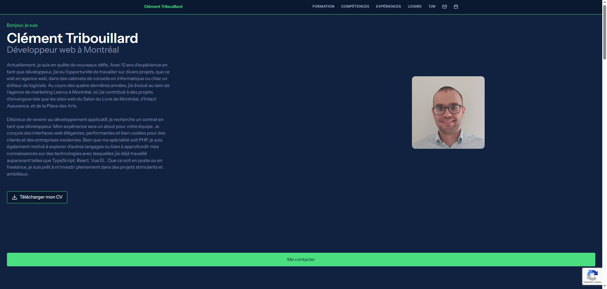
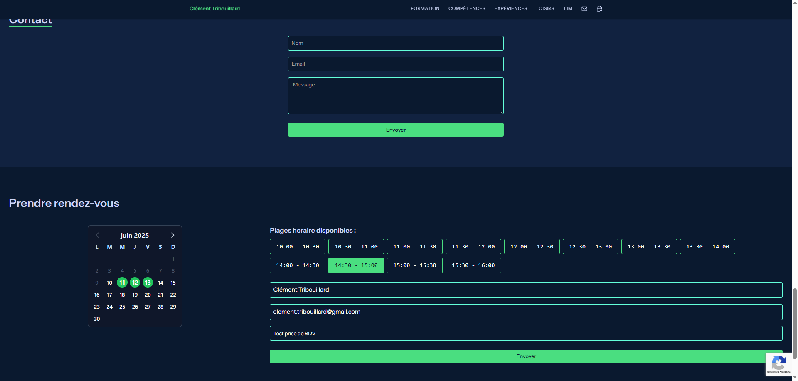
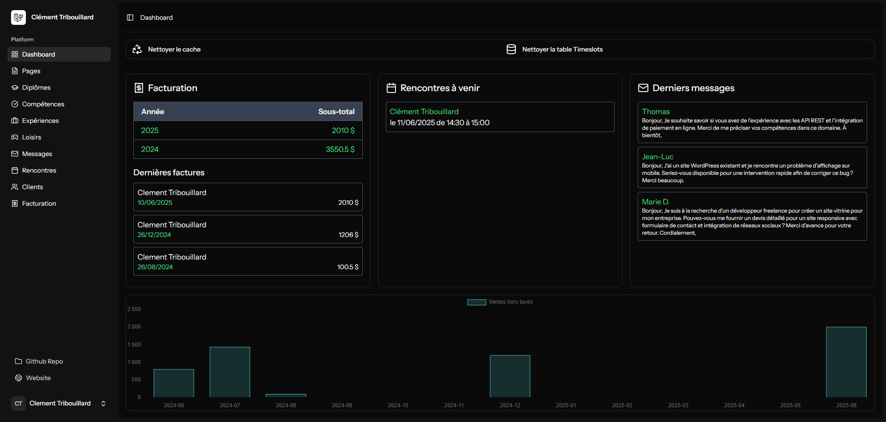

## Présentation de l'application

Cette application est une **Single Page Application** développée pour présenter mon parcours universitaire et professionnel.  
Elle inclut plusieurs sections dynamiques que je peux éditer moi-même :  
**"Hero"**, **"Formation"**, **"Compétences"**, **"Expériences"**, **"Loisirs"** et **"TJM"**.

### Fonctionnalités principales

- **Frontoffice** :  
  - Présentation de mon profil.
  - Formulaire de contact.
  - Prise de rendez-vous avec génération automatique d'une invitation **Google Meet**.
  - Génération de mon **CV au format PDF**.

- **Backoffice** (pour usage personnel en tant que travailleur autonome) :  
  - Gestion des **clients** : créer, modifier, supprimer.
  - Création de **factures** : export en PDF ou envoi par email au client.
  - Export **CSV** des factures pour une période donnée.
  - Tableau de bord synthétique :
    - Sommes facturées par **année** (3 dernières années).
    - Sommes facturées par **mois** (13 derniers mois).

### Exemple en ligne

Vous pouvez consulter une version en ligne de l'application à l'adresse suivante :  
👉 [https://clementtribouillard.com](https://clementtribouillard.com)

Cette instance présente l'ensemble des fonctionnalités, incluant :
- l'affichage public de mon profil professionnel,
- le formulaire de contact,
- la prise de rendez-vous avec génération d’un lien Google Meet,
- ainsi que l'espace d'administration privé utilisé pour la gestion des factures et des contenus.

### Aperçu visuel

Vous pouvez consulter des captures d’écran [ici](https://clementtribouillard.com/screenshoots).

  
  


---

## Développement

```bash
# Créer le fichier .env à la racine du projet
composer run dev
```

### Déploiement en production

```bash
npm install
npm run build
composer artisan migrate
```

💡 Si vous n'avez pas accès SSH à votre serveur, vous pouvez utiliser le script présent dans .github/workflows/deploy.yml pour automatiser le déploiement.

---

## About Laravel

Laravel is a web application framework with expressive, elegant syntax. We believe development must be an enjoyable and creative experience to be truly fulfilling. Laravel takes the pain out of development by easing common tasks used in many web projects, such as:

- [Simple, fast routing engine](https://laravel.com/docs/routing).
- [Powerful dependency injection container](https://laravel.com/docs/container).
- Multiple back-ends for [session](https://laravel.com/docs/session) and [cache](https://laravel.com/docs/cache) storage.
- Expressive, intuitive [database ORM](https://laravel.com/docs/eloquent).
- Database agnostic [schema migrations](https://laravel.com/docs/migrations).
- [Robust background job processing](https://laravel.com/docs/queues).
- [Real-time event broadcasting](https://laravel.com/docs/broadcasting).

Laravel is accessible, powerful, and provides tools required for large, robust applications.

### Learning Laravel

Laravel has the most extensive and thorough [documentation](https://laravel.com/docs) and video tutorial library of all modern web application frameworks, making it a breeze to get started with the framework.

You may also try the [Laravel Bootcamp](https://bootcamp.laravel.com), where you will be guided through building a modern Laravel application from scratch.

If you don't feel like reading, [Laracasts](https://laracasts.com) can help. Laracasts contains thousands of video tutorials on a range of topics including Laravel, modern PHP, unit testing, and JavaScript. Boost your skills by digging into our comprehensive video library.

### Security Vulnerabilities

If you discover a security vulnerability within Laravel, please send an e-mail to Taylor Otwell via [taylor@laravel.com](mailto:taylor@laravel.com). All security vulnerabilities will be promptly addressed.

### License

The Laravel framework is open-sourced software licensed under the [MIT license](https://opensource.org/licenses/MIT).
